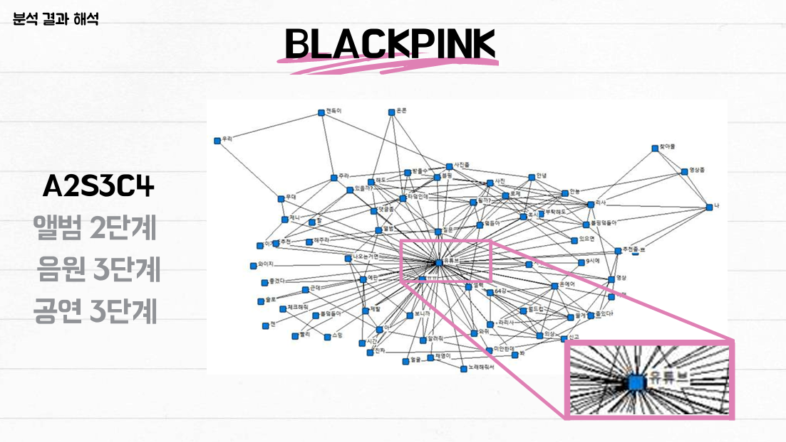
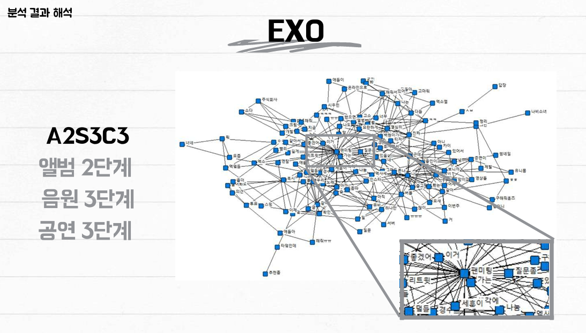

# Strategic Analysis of K-pop Artist Activities using Typology and Social Network Analysis (SNA)
2024-1 Main Project - Group G An integrated analytical framework bridging Artist Performance Metrics and Fandom Discourse Networks using Social Network Analysis.

## 1. Project Overview
This project evaluates and proposes data-driven strategies for K-pop artists by integrating Quantitative Activity Data (Typology) and Qualitative Fandom Sentiment (SNA).

### The Problem
- Gap in Insights: Discrepancy between commercial success (Album/Digital sales) and actual fandom needs.
- Methodological Limit: Absence of tools to quantify and visualize complex fandom interactions and core discourse.

### Our Solution
We diagnose the artist's market position through Typology and visualize the hidden structures of fan needs through Social Network Analysis (SNA) to align artist activities with customer (fan) expectations.

## 2. Project Pipeline & Methodology

### Phase 1: Artist Typology & Performance Analysis (My Core Part)
- Data: Cumulative Physical Album Sales (2018-2023) & Digital Streaming/Download Rankings (2018-2024).
- Method: Developed a strategic matrix to categorize artists based on the skewness of Music Chart and relative ratio of physical albums by comparing to other artists.
- 
### Phase 2: Fandom Discourse Mapping via SNA (Team Part)
- Data: YouTube Comments & Post titles from 'Theqoo' (Korean online community).
- Method: Conducted Social Network Analysis (SNA) using UCINET 6.
- Output: 1-mode network visualization based on keyword co-occurrence frequency.

## 3. Key Contributions (Team Roles)
- Performance Metrics & Strategic Typology
- Data Collection: Collected and preprocessed multi-year performance data from physical and digital charts.
- Typology Framework: Designed the artist growth model and strategic categorization matrix.
- Strategic Audit: Identified strategic "misses" by cross-referencing SNA findings with artist typology.

## 4. Analysis Results (Case Studies)
- SNA Insight: Identified core fandom keywords for artists like BLACKPINK, NMIXX, EXO, and DAY6 through centrality analysis.
- Strategy Proposal: Provided tailored strategic audits by comparing fandom needs with the artist's current positioning.

[result examples]

### BLACKPINK: Global Performance Leader
- **Typology**: A2 / S3 / C4 (High performance in Digital & Concerts)
- **SNA Insight**: High centrality in "Performance" and "Global Tour" related keywords.
- **Strategic Proposal**: Focus on maintaining global concert scale while reinforcing digital engagement.

### EXO: Strong Fandom Core
- **Typology**: A2 / S3 / C3 (Balanced High performance)
- **SNA Insight**: Strong clusters around "Fandom Loyalty" and "Discography."
- **Strategic Proposal**: Strategy to leverage established fandom power for sustainable activities.

## 5. Tech Stack
- Programming: Python (Google Colab)
- SNA Tools: UCINET 6, NetDraw
- Libraries: Pandas, KoNLPy, Matplotlib, Seaborn
- Domain: K-pop Strategic Planning, Data Science, Social Network Analysis
